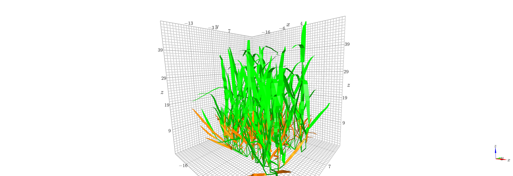

.. Do not edit this file. Edit user/overview.txt, user/index user/autosum 
.. You may add as many files as you want in ./user.

.. _adel:

.. module:: adel

Welcome to Openalea Adel's documentation
########################################

OpenAlea.Adel (Architectural model of DEvelopment based on L-systems)
allows to simulate the 3D architectural development of the shoot of
gramineaous plant.
The package hosts generic data structure and simulation tools for
gramineaous plants (Fournier & Pradal, unpublished), the Adel-Maize
[fournier1999]_, Adel-Wheat [fournier2003]_ models,
together with the wheat parameterization model of [abichou2013]_
and the plastic leaf model of [fournier2012]_.

Documentation
=============

.. toctree::
    :maxdepth: 2

    User Guide<user/index.rst>
    Notebook example<example/notebook.rst>
    Reference Guide<user/autosum.rst>
    ./references.rst

- A `PDF <../latex/adel.pdf>`_ version of |adel| documentation is 
  available.

.. seealso::

   More documentation can be found on the
   `openalea <http://openalea.gforge.inria.fr/dokuwiki/doku.php?id=packages:openalea:adel:adel>`__ wiki.

Authors
=======

.. include:: ../AUTHORS.txt

ChangeLog
=========

.. include:: ../ChangeLog.txt

License
=======

|adel| is released under a Cecill-C License.

.. note:: `Cecill-C <http://www.cecill.info/licences/Licence_CeCILL-C_V1-en.html>`_ 
    license is a LGPL compatible license.

.. |adel| replace:: OpenAlea.Adel
